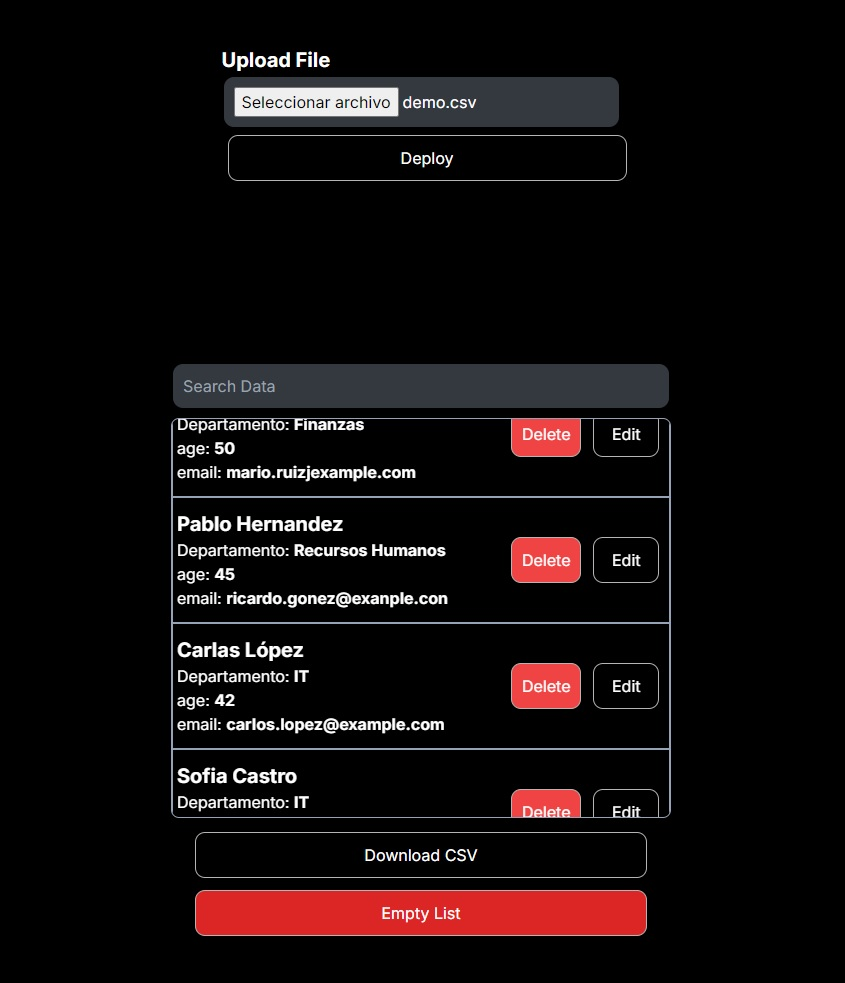

## User Management CSV




This is an application to upload CSV files and manage them. You can easily delete, update or add new data within the file.

<p align="center">
  <a href="https://nextjs.org/docs/" target="blank"></a>
  <a href="https://tailwindcss.com/" target="blank"></a>
  <a href="https://www.typescriptlang.org/" target="blank"></a>
  <a href="http://nestjs.com/" target="blank"></a>
  <a href="https://www.postgresql.org/" target="blank"></a>
  <a href="https://www.prisma.io/" target="blank"></a>
</p>


> [!IMPORTANT]
> Follow the steps stated in the documentation to avoid having any problems. If you have any questions, you can consult the documentation of the respective services. ```./client ``` for the front-end and ```./server``` for the back-end.

## API Documentation
The API is documented using Swagger. You can access the full documentation by visiting Port: [/api/#/](http://localhost:3001/api/#/)
on your server after launching the application.

>[!NOTE]
> In order for the file to be uploaded and modified, it must comply with these columns.

```SQL
ID | Nombre | Departamento | Edad | Email
```
In case you want to modify the columns, you can enter the ``./Server/Prisma`` folder and change as needed.

## Intall and Run 

```bash
$ docker-compose up 
```


Port App: [3000](http://localhost:3000/)

## Requirements

- Nodejs (optional)
- Nestjs (optional)
- Docker

## License

Made by Dario Marzzucco.
